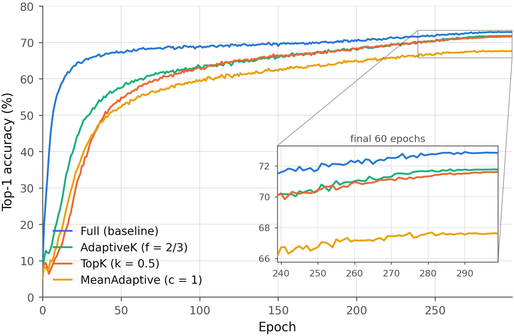
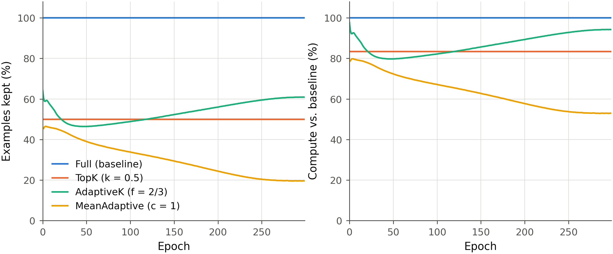
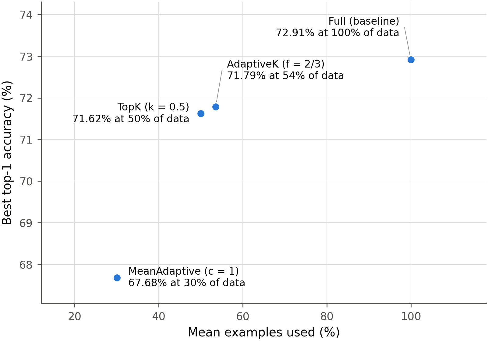

# Reducing Redundancy in Neural Network Training

[](https://github.com/TeoMal/Reducing-Redundancy/actions/workflows/ci.yml)

Code accompanying the BSc thesis **_[Reducing Redundancy in Neural Network
Training](https://pergamos.lib.uoa.gr/item/uoadl:5304088)_** (Theodoris V.
Mallios, supervised by Prof. Dimitrios Achlioptas, Department of Informatics and
Telecommunications, National and Kapodistrian University of Athens, 2025).

Modern training pipelines treat every example and every gradient component
equally, even though empirical evidence shows that late in training many
examples produce small, redundant gradients. This repository provides a small,
readable framework for experimenting with two families of techniques that skip
that redundant computation while preserving accuracy:

- **Loss-based example selection** — back-propagate only a subset of high-loss
  examples per mini-batch (`TopK`, `AdaptiveK`, `MeanAdaptive`).
- **Low-rank gradient approximation** — project each layer's gradient onto its
  top singular directions, discarding the low-energy tail.

The code is organised so that datasets, models and methods are independent and
easy to swap or extend.

---

## Results: ViT-B/16 on ImageNet-1k

Four 300-epoch runs, identical in every respect except the selector.

| Method | top-1 | top-5 | examples used | compute (modelled) | Δ top-1 |
| ------ | -----: | -----: | -----: | -----: | -----: |
| `full` (baseline)     | **72.91** | 89.38 | 100.0% | 100.0% | — |
| `adaptive_k` f = 2/3  | 71.79 | 88.81 | 53.5% | 86.9% | −1.13 |
| `topk` k = 0.5        | 71.62 | 88.67 | 50.0% | 83.3% | −1.29 |
| `mean_adaptive` c = 1 | 67.68 | 86.78 | 30.0% | 63.4% | −5.23 |



`adaptive_k` and `topk` land roughly 1.1–1.3 points below the baseline while
back-propagating about half the examples. `mean_adaptive` is far more aggressive
— 30% of examples for 63% of the compute — and pays 5.2 points for it.

### What the selectors actually keep



`topk` keeps a fixed 50% by construction. The two adaptive rules are not
variations on one behaviour — they move in **opposite directions**:

| | epoch 0 | minimum | epoch 299 | final compute |
| --- | ---: | ---: | ---: | ---: |
| `adaptive_k` f = 2/3  | 64% | 46% (epoch 46) | **61%** | **94.2%** |
| `mean_adaptive` c = 1 | 46% | — | 20% | 52.9% |

`mean_adaptive` tightens monotonically: its threshold is a multiple of the batch
mean, and as the loss distribution concentrates fewer examples clear it. It ends
at 20% of the batch — and pays 5.2 points of accuracy for starving itself
exactly when the remaining hard examples carry the most signal.

`adaptive_k` does the reverse. It keeps the fewest examples covering 2/3 of the
batch's total loss, which is cheap while a few hard examples dominate the mass.
Once training converges — and especially under label smoothing, which puts a
floor under every example's loss — the distribution *flattens*, and covering
two thirds of the mass starts to require close to two thirds of the examples. Its
budget bottoms out at 46% near epoch 46 and climbs back to 61%.

The consequence is easy to miss in an average: `adaptive_k`'s compute ratio ends
at **94.2%**, a whisker from the break-even point derived below. It earns the
best accuracy of the three selectors partly by quietly reverting toward full-batch
training as it converges. A run reported only as a mean (86.9%) hides this;
the per-epoch curve does not.



### Limitation: we did not measure a wall-clock saving

`compute_ratio` above is an **analytic FLOP model**, not a stopwatch. Our runs
cannot confirm it, and we want to be explicit about that:

| Method | modelled compute | measured throughput |
| ------ | -----: | -----: |
| `full`          | 100.0% | 2467 img/s |
| `topk`          |  83.3% | 2466 img/s |
| `adaptive_k`    |  86.9% | 2515 img/s |
| `mean_adaptive` |  63.4% | 2516 img/s |

A 37-point spread in modelled compute produced **no measurable throughput
difference**. All four runs were co-scheduled on the same hardware and were
bound by JPEG decoding in the input pipeline, not by the GPU — so these numbers
say nothing about whether `two_pass` saves time. Establishing that requires one
run at a time on an uncontended node with a loader fast enough to saturate the
GPUs. Treat the `compute_ratio` column as a model until then.

### Reproducing

Hardware: 4 × NVIDIA RTX PRO 6000 Blackwell, ~17 h per run at 300 epochs.

```bash
torchrun --standalone --nproc_per_node=4 train.py \
    --dataset imagenet --data-root /path/to/imagenet --model vit_b_16 \
    --method full \
    --optimizer adamw --lr 1e-3 --weight-decay 0.05 --warmup-epochs 5 \
    --label-smoothing 0.1 --dropout 0.1 \
    --epochs 300 --batch-size 128 --accum-steps 2 \
    --amp bf16 --grad-clip 1.0 --drop-last \
    --num-workers 20 --ckpt-dir ckpt/vit_b16_full --ckpt-every 10
```

Swap `--method full` for `--method topk --k 0.5 --selection-mode two_pass` (or
`adaptive_k` / `mean_adaptive`) to reproduce the other rows. Global batch is
`128 × 4 GPUs × 2 accum = 1024`; if you have a different GPU count, hold that
product constant so the learning rate stays valid.

Raw per-epoch logs for all four runs are committed under
[`docs/results/tuned_300ep/`](docs/results/tuned_300ep/), one complete CSV per
method.

---

## Repository structure

```
redundancy/
├── datasets/            # one subpackage per dataset (data loaders + architectures)
│   ├── base.py          #   shared DatasetMeta / DataBundle / dataloader helpers
│   ├── cifar10/         #   data.py (loaders + transforms) + models.py (registry)
│   ├── cifar100/
│   ├── imagenet/        #   ImageFolder-based; not auto-downloaded
│   ├── mnist/
│   └── svhn/
├── models/              # shared architectures (resnet18, vgg16, cnn, mlp, vit_*)
├── methods/             # the redundancy-reduction techniques
│   ├── selection.py     #   loss-based example selectors
│   └── lowrank.py       #   low-rank gradient approximation
├── engine/              # training / evaluation loop + metrics
│   ├── trainer.py       #   AMP, gradient accumulation, DDP, checkpointing
│   └── distributed.py   #   torchrun plumbing (no-op in single-process runs)
└── utils/               # seeding, CSV logging
train.py                 # command-line entry point
scripts/
├── plot_results.py          # overlay a metric across runs
├── make_figures.py          # render the figures in this README
├── prepare_imagenet.py      # HuggingFace parquet -> ImageFolder
├── imagenet_download.sh     # fetch the ImageNet-1k parquet shards
└── imagenet_convert.sh      # run the conversion end to end
tests/smoke_test.py      # fast, download-free end-to-end checks
```

Each dataset lives in its **own folder** bundling the data loaders, normalisation
statistics and the architectures appropriate for it — so running on a new
dataset is a self-contained addition (see [Adding a dataset](#adding-a-dataset)).

## Installation

Requires Python >= 3.9 and PyTorch >= 2.0. A GPU is optional but recommended.

```bash
git clone https://github.com/TeoMal/Reducing-Redundancy.git
cd Reducing-Redundancy
python3 -m venv .venv
source .venv/bin/activate
python -m pip install --upgrade pip
python -m pip install -e .
```

For development, include the test dependencies:

```bash
python -m pip install -e ".[dev]"
```

> **Blackwell (sm_120) GPUs** — install the CUDA 12.8 PyTorch wheel before the
> editable package install:
>
> ```bash
> python -m pip install torch --index-url https://download.pytorch.org/whl/cu128
> python -m pip install -e .
> ```
>
> A cu124 build ships kernels only up to sm_90 and fails at runtime with
> "no kernel image is available".

Verify the environment before starting a run:

```bash
python -c "import torch, torchvision, redundancy; print(torch.__version__); print('CUDA:', torch.cuda.is_available())"
```

## Quickstart

```bash
# Baseline ResNet-18 on CIFAR-10
python train.py --dataset cifar10 --model resnet18 --method full --epochs 30

# MeanAdaptive selection, plain cross-entropy for the final 10 epochs
python train.py --dataset cifar10 --method mean_adaptive --c 1.0 --ce-tail-epochs 10

# AdaptiveK selection with VGG-16 on CIFAR-100
python train.py --dataset cifar100 --model vgg16 --method adaptive_k --fraction 0.667

# Low-rank gradients, keeping 90% of each gradient's spectral energy
python train.py --dataset svhn --method full --low-rank-energy 0.9
```

Each run writes a per-epoch CSV to `outputs/<dataset>_<model>_<method>.csv`. Its
columns are train/eval accuracy plus:

| Column                       | Meaning                                                            |
| ---------------------------- | ------------------------------------------------------------------ |
| `effective_ratio`            | Fraction of examples that contributed to the update — the quantity these methods aim to drive down. |
| `compute_ratio`              | Fraction of the baseline's FLOPs actually spent. **This is the one that reflects a real saving** — see [What selection actually saves](#what-selection-actually-saves---selection-mode). |
| `images_per_sec`, `train_seconds` | Measured throughput, so `compute_ratio` can be checked against the clock. |
| `mean_rank`                  | Mean rank retained by the low-rank projection, when enabled.        |

Run `python train.py --help` for the full list of options.

> **Logs are overwritten, not appended.** `CSVLogger` opens its file with mode
> `w` and the name depends only on dataset/model/method, so a second run of the
> same configuration — including a job that restarts and resumes — truncates the
> first one's log. Archive or rename the CSV before re-running, especially on a
> scheduler that may restart a job mid-run.

Overlay results across runs:

```bash
python scripts/plot_results.py outputs --metric eval_acc_top1
python scripts/plot_results.py outputs --metric compute_ratio -o compute.png
```

## Methods

### Loss-based example selection (`--method`)

Given the per-example cross-entropy losses of a mini-batch, a selector decides
which examples contribute to the backward pass. Selected losses are averaged so
the effective learning rate stays comparable regardless of how many are kept.

| `--method`      | Rule                                                               | Key argument |
| --------------- | ------------------------------------------------------------------ | ------------ |
| `full`          | Use every example (standard cross-entropy).                        | –            |
| `topk`          | Keep the top-`k` fraction of examples by loss.                     | `--k`        |
| `adaptive_k`    | Fewest top-loss examples covering a `fraction` of the batch loss.  | `--fraction` |
| `mean_adaptive` | Keep examples whose loss exceeds `c ×` the batch mean loss.        | `--c`        |

`--ce-tail-epochs N` reverts to plain cross-entropy for the final `N` epochs, a
simple way to "polish" the model once selection has done the bulk of the work.

#### What selection actually saves (`--selection-mode`)

Selecting examples reduces the *training signal* you pay for, but whether it
reduces *wall-clock cost* depends entirely on how the selection is realised.

| `--selection-mode` | Behaviour                                                                     | Real saving?          |
| ------------------ | ----------------------------------------------------------------------------- | --------------------- |
| `masked` (default) | Forward the whole batch, back-propagate a loss reduced over the selected subset. | **No** — every matmul in the backward pass is still full-size. `effective_ratio` is a hypothetical saving. |
| `two_pass`         | Score the batch under `no_grad`, then re-forward + backward on the subset only. | **Yes** — but less than `1 − effective_ratio`, because the scoring pass is not free. |

`masked` is the default so existing CIFAR results stay reproducible. Use
`two_pass` when you want to measure a saving rather than assume one.

Counting a forward as 1 unit and a backward as 2, a baseline step on `B`
examples costs `3B`, while a two-pass step keeping `m` costs `B + 3m`. With
`r = m/B` the cost relative to baseline is `(1 + 3r) / 3`:

| Kept fraction `r` | Compute vs baseline | Saving        |
| ----------------- | ------------------- | ------------- |
| 1.00              | 133%                | −33% (slower) |
| **0.67**          | **100%**            | **break-even** |
| 0.50              | 83%                 | 17%           |
| 0.33              | 67%                 | 33%           |
| 0.10              | 43%                 | 57%           |
| → 0               | → 33%               | → 67% (ceiling) |

Two consequences worth internalising before spending GPU-hours:

- **Break-even is at `r = 2/3`.** `adaptive_k` with its default
  `--fraction 0.667` typically keeps *more* than two thirds of a batch early in
  training, so it can be a net **slowdown** despite a favourable
  `effective_ratio`. Check the `compute_ratio` column, not `effective_ratio`.
- **The ceiling is a 67% saving**, approached only as you keep almost nothing.
  Any method that must look at every example to decide cannot beat it. Getting
  past this needs a *cheaper* scorer than a full forward pass — stale losses
  from the previous epoch, a low-resolution pass, or a small proxy model.

A third consequence shows up in our results above: **none of this is visible on
the clock unless the input pipeline can keep the GPUs fed.** All four ImageNet
runs hit the same throughput regardless of compute ratio, because they were
data-loader bound.

### Low-rank gradient approximation (`--low-rank` / `--low-rank-energy`)

After `backward()` and before the optimiser step, each parameter's gradient is
reshaped to a matrix and replaced by its best rank-`r` approximation (SVD).
Use a **fixed** rank with `--low-rank R`, or choose the rank **adaptively** per
tensor to retain a fraction of the spectral energy with `--low-rank-energy E`.
The mean rank used per epoch is logged in the `mean_rank` column.

## Datasets and models

| Dataset     | `--dataset` | Classes | Input      | Models (`--model`)                                       |
| ----------- | ----------- | ------- | ---------- | -------------------------------------------------------- |
| CIFAR-10    | `cifar10`   | 10      | 3×32×32    | `resnet18`, `vgg16`, `cnn`                               |
| CIFAR-100   | `cifar100`  | 100     | 3×32×32    | `resnet18`, `vgg16`, `cnn`                               |
| MNIST       | `mnist`     | 10      | 1×28×28    | `cnn`, `mlp`, `resnet18`                                 |
| SVHN        | `svhn`      | 10      | 3×32×32    | `resnet18`, `vgg16`, `cnn`                               |
| ImageNet-1k | `imagenet`  | 1000    | 3×224×224  | `vit_ti_16`, `vit_s_16`, `vit_b_16`, `vit_l_16`, `resnet18` |

The small datasets download automatically to `--data-root` (default `data/`,
git-ignored). **ImageNet does not** — see below.

The ViT variants follow the standard widths (Ti 5.7M, S 22.1M, B 86.6M, L 304M
parameters); Ti and S are built from `torchvision`'s generic
`VisionTransformer` since it only ships B/L/H.

## Scaling up

The trainer supports what a large run needs. All of it is off by default, so
small-scale runs stay simple.

| Flag                       | Effect                                                                 |
| -------------------------- | ---------------------------------------------------------------------- |
| `--amp {bf16,fp16}`        | Mixed precision. `bf16` needs Ampere or newer and skips the loss scaler; `fp16` uses a `GradScaler`. |
| `--accum-steps N`          | `N` micro-batches per optimiser step — raises the effective batch without raising memory. Under DDP the gradient all-reduce is skipped on non-final micro-batches. |
| `torchrun --nproc_per_node=N` | DistributedDataParallel. Each split gets a `DistributedSampler`; metrics are all-reduced so the logs describe the whole epoch, not rank 0's shard. |
| `--channels-last`          | NHWC memory format (helps convnets on tensor cores).                    |
| `--compile`                | `torch.compile` the model.                                              |
| `--ckpt-dir D --ckpt-every N` | Checkpoint model/optimiser/scheduler/scaler state. Checkpoints are never pruned and a ViT-B/16 state is ~1 GB, so use `N > 1` on long runs. |
| `--resume PATH`            | Resume from a checkpoint (requires the same `--optimizer`).             |
| `--warmup-epochs N`        | Linear LR warmup before cosine decay, stepped per optimiser step. ViTs need this. |
| `--optimizer adamw`        | AdamW, the standard choice for transformers.                            |
| `--label-smoothing S`      | Cross-entropy label smoothing. Composes with per-example selection.     |
| `--dropout D`, `--attention-dropout D` | Regularisation inside the ViT blocks.                       |

`--batch-size` is **per process**: the global batch is
`--batch-size × nproc_per_node × --accum-steps`, and the run banner prints it.

## ImageNet-1k

ImageNet cannot be fetched automatically. Either register at
[image-net.org](https://image-net.org), or use the HuggingFace copy — which is
what the helper scripts here do:

```bash
bash scripts/imagenet_download.sh   # ~153 GB of parquet (train + validation)
bash scripts/imagenet_convert.sh    # -> ImageFolder layout, ~1.28M files
```

`ILSVRC/imagenet-1k` is gated: accept the terms on the dataset page and run
`hf auth login` first. The conversion writes `class_0000 … class_0999`
directories, whose alphabetical order matches the integer labels, and asserts
1000 classes in both splits before finishing — a partial conversion would
otherwise shift every label silently.

The final layout is the conventional one, so an existing ImageNet copy works
unchanged:

```
<root>/train/<class>/*.JPEG
<root>/val/<class>/*.JPEG
```

The augmentation recipe is plain `RandomResizedCrop` + horizontal flip —
deliberately *not* RandAugment/mixup/erasing. Identical, simple preprocessing
across runs keeps the selector-vs-selector comparison clean, and mixup in
particular is awkward here: a mixed sample has no single label, so "the
per-example loss" that selection is built on stops being well defined.
`--label-smoothing` and `--dropout` are supported because they regularise
without disturbing per-example losses.

Shake the pipeline out on a few hundred images and `--model vit_ti_16` before
committing to a full run.

## Adding a dataset

1. Create `redundancy/datasets/<name>/` with:
   - `data.py` — a `META` (`DatasetMeta`) and a `build(root, val_ratio, seed,
     download) -> DataBundle` function (copy an existing folder as a template).
   - `models.py` — a `MODELS` dict of `{name: constructor}` drawn from
     `redundancy.models.backbones`, plus a `DEFAULT_MODEL`.
   - `__init__.py` — re-export `build`, `META`, `MODELS`, `DEFAULT_MODEL`.
2. Register it in `redundancy/datasets/__init__.py` (`_DATASETS`).

That's it — `train.py`, the plotting script and the smoke test pick it up
automatically.

## Tests

```bash
python -m tests.smoke_test      # or: pytest tests/smoke_test.py
```

The smoke test runs entirely on random tensors (no downloads): it checks that
every registered model outputs class logits, every selector is well-formed, the
low-rank projection preserves shapes, and the training loop completes an epoch.

## Citation

```bibtex
@thesis{mallios2025redundancy,
  title  = {Reducing Redundancy in Neural Network Training},
  author = {Mallios, Theodoris V.},
  school = {National and Kapodistrian University of Athens},
  year   = {2025},
  type   = {BSc thesis},
  url    = {https://pergamos.lib.uoa.gr/item/uoadl:5304088},
  note   = {Supervisor: Prof. Dimitrios Achlioptas}
}
```

The same metadata is in [`CITATION.cff`](CITATION.cff), which GitHub reads for
the "Cite this repository" button.

## License

Released under the terms of the [LICENSE](LICENSE) file in this repository.
